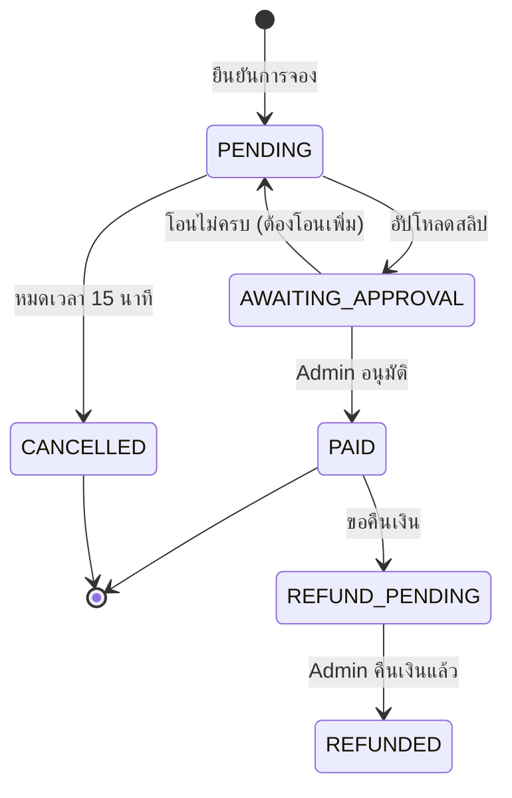

# 🌍 9Tours - Tour Booking Website

ระบบจองทัวร์ออนไลน์ที่ช่วยให้ลูกค้าดูทัวร์และจองได้เองพร้อมเห็นที่นั่งคงเหลือแบบ Real-time และแอดมินจัดการทุกอย่างได้ในระบบเดียว

---

## 📌 Problem Statements

1. การจองทัวร์ผ่านแชท/โทรทำให้ข้อมูลตกหล่นและตามสถานะการจองยาก
2. ลูกค้าไม่เห็น "ที่นั่งคงเหลือ" แบบ Real-time
3. แอดมินจัดการโปรแกรมทัวร์/รายชื่อลูกค้า/สถานะการชำระเงินแบบกระจัดกระจาย ไม่มีระบบเดียวจบ

---

## 🎯 Objectives

- ลูกค้าดูทัวร์และจองได้เอง พร้อมเห็นที่นั่งคงเหลือ + ระบบตัดที่นั่งอัตโนมัติ
- แอดมิน CRUD ทัวร์ + จัดการสถานะการจอง/จ่ายเงิน
- ลูกค้าดูสถานะและประวัติการจองของตัวเองได้

---

## ✨ Features

### 👤 Customer Features
| Feature | Description |
|---------|-------------|
| 🔍 **ค้นหาทัวร์** | Fuzzy Search, กรองตามภาค/จังหวัด/เทศกาล/ช่วงเวลา/ราคา/รหัสทัวร์ |
| 📋 **ดูรายละเอียด** | รายละเอียดทัวร์ + ที่นั่งคงเหลือ + สถานะว่าง/เต็ม |
| 🎫 **จองทัวร์** | ระบุจำนวนผู้เดินทาง + เลือกวันที่ตามเงื่อนไขแพ็กเกจ |
| 💳 **ชำระเงิน** | จ่ายผ่าน QR + อัปโหลดสลิป |
| 📜 **ประวัติการจอง** | ดูสถานะปัจจุบัน + ประวัติทั้งหมด |

### 🛡️ Admin Features
| Feature | Description |
|---------|-------------|
| 📦 **CRUD ทัวร์** | เพิ่ม/ลบ/แก้ไขโปรแกรมทัวร์ + อัปโหลดรูป |
| 👥 **ดูรายชื่อลูกค้า** | ชื่อ, จำนวนคน, สถานะ ของแต่ละแพ็กเกจ |
| ✅ **จัดการสถานะ** | เปลี่ยนสถานะเป็น PAID / CANCELLED / REFUNDED |
| 📊 **Dashboard** | Monitor รายได้, จำนวนลูกค้าแยกตามสถานะ/ภาค/จังหวัด |

### 🪑 Seat Management
- ระบบ **ไม่หักที่นั่งทันที** เมื่อกดยืนยันการจอง
- ต้อง **ชำระเงินภายใน 15 นาที** ไม่งั้นยกเลิกอัตโนมัติ + คืนที่นั่ง
- เมื่อแอดมินยืนยัน PAID → ที่นั่งถูกตัด

---

## 🏗️ Tech Stack

| Layer | Technology |
|-------|------------|
| **Frontend** | React + Vite + TypeScript |
| **Backend** | NestJS + TypeORM |
| **Database** | PostgreSQL 15 |
| **Container** | Docker + Docker Compose |
| **CI/CD** | GitHub Actions |

---

## 🚀 Getting Started

### Prerequisites
- Node.js 20+
- Docker Desktop
- Git

### 1. Clone Repository
```bash
git clone https://github.com/your-org/9tours.git
cd 9tours
```

### 2. Setup Environment Variables
```bash
# Root level (for Docker)
cp .env.example .env

# Backend
cp backend/.env.example backend/.env
```

**Required `.env` variables:**
```env
DB_HOST=localhost
DB_PORT=5432
DB_USERNAME=init
DB_PASSWORD=your_password
DB_DATABASE=9tours_db
PORT=3000
```

### 3. Start Database
```bash
docker-compose up -d
```

### 4. Run Backend
```bash
cd backend
npm install
npm run start:dev
```

### 5. Run Frontend
```bash
cd frontend
npm install
npm run dev
```

---

## 📁 Project Structure

```
9tours/
├── .github/workflows/    # CI/CD configs
├── backend/              # NestJS API
│   ├── src/
│   │   ├── tours/        # Tours module
│   │   └── ...
│   └── .env.example
├── frontend/             # React + Vite
│   └── src/
├── documentation/        # ER Diagram, Specs
├── docker-compose.yml
└── README.md
```

---

## 📊 Booking Status Flow



---

## 🧪 KPI & Success Criteria

### Quantitative
- ✅ ไม่เกิดเคสจองเกิน (Overbooking = 0)
- ✅ ที่นั่งคงเหลือถูกต้อง 100%
- ✅ Test Cases ผ่าน ≥ 90%
- ✅ Customer Flow ≤ 2 นาที
- ✅ Admin Flow ≤ 3 นาที

### Qualitative
- ✅ User Flow ชัดเจน (ไม่หลงทาง)
- ✅ Error Messages บอกสาเหตุชัด
- ✅ UI Consistency
- ✅ Responsive บนมือถือ

---

## 👥 Team

| Role | Student ID | Responsibilities |
|------|------------|------------------|
| **PM & UI/UX** | 6810110229 | Requirement, Figma, Timeline, QA |
| **Frontend Dev** | 6810110347 | React, Responsive, API Integration |
| **Backend Dev** | 6810110167 | NestJS, TypeORM, Auth, API |
| **QA & DevOps** | 6810110712 | Testing, Docker, CI/CD |

---

## 🚫 Out of Scope

- ระบบชำระเงินจริง / ตรวจสลิปอัตโนมัติ / เชื่อมธนาคาร
- เลือกเลขที่นั่งละเอียดแบบโรงหนัง
- คูปอง / แต้มสะสม
- รีวิว / แชท / อีเมลแจ้งเตือน

---

## 📄 License

This project is for educational purposes.

---

## 🔗 Links

- [ER Diagram](./documentation/Project9%20(Classified).png)
- [GitHub Actions CI](./.github/workflows/ci.yml)
- [PR Template](./.github/workflows/pull_request_template.md)
