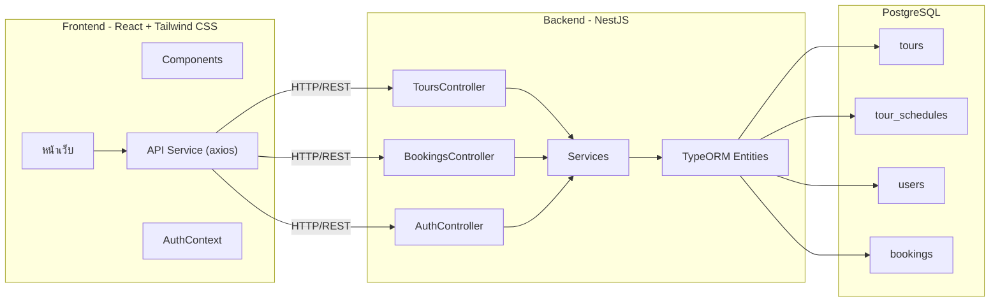
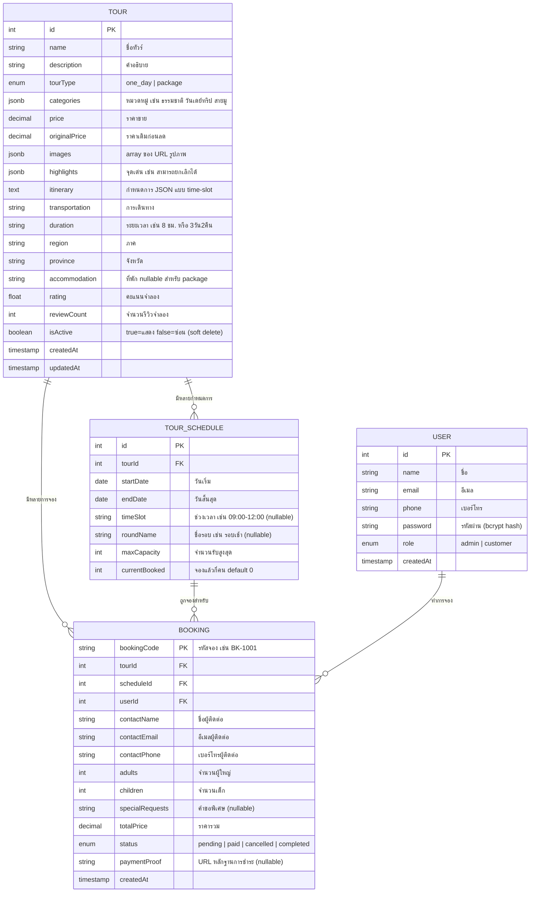

# 9Tours - แผน Demo V1 (ส่งวันที่ 20 ก.พ.)

ปรับปรุงล่าสุดจากการวิเคราะห์ Figma ครบทุกหน้า

## สถานะปัจจุบัน

- Backend: โครงสร้าง NestJS มีอยู่แล้ว แต่ Tour entity ว่างเปล่า, service/controller เป็น stub
- Frontend: Template เริ่มต้นของ Vite + React (ยังไม่มีหน้าใดเลย ยังไม่มี routing)
- Database: PostgreSQL ผ่าน Docker ตั้งค่าไว้แล้ว แต่ยังไม่มี entity/table

## ข้อกำหนดสำหรับ Demo (25 คะแนน)

1. **Admin CRUD** - เพิ่ม/แก้ไข/ลบทัวร์ได้ (ต้องทำ)
2. **แสดงข้อมูลจาก DB** - หน้ารายการทัวร์ + หน้ารายละเอียดทัวร์ (ต้องทำ)
3. **Register/Login เบื้องต้น** (ถ้าทำทัน, คะแนนเพิ่ม)

---

## สรุป Design จาก Figma

### Design System (จาก Figma)

- **สีหลัก**: เหลือง/ทอง (#F5A623 โดยประมาณ) - ใช้ใน navbar, ปุ่ม, จุดเน้น
- **พื้นหลัง**: ขาว
- **ตัวอักษร**: เทาเข้ม/ดำ
- **โลโก้**: "9Tours" ตัว "9" สีเหลือง
- **รายการ Navbar**: หน้าแรก, วันเดย์ทริป, เที่ยวพร้อมที่พัก, การจองออนไลน์, เข้าสู่ระบบ (ปุ่มเหลือง)
- **Auth**: Login/Register เป็น **modal overlay** (ไม่ใช่หน้าแยก)

### หน้าทั้งหมดจาก Figma

1. **หน้าแรก** - Hero พร้อม search (สถานที่, วันที่, จำนวนคน), แถบหมวดหมู่ (ธรรมชาติ, วันเดย์ทริป, เที่ยวพร้อมที่พัก, สายมู, สายชิล), การ์ดสถานที่, การ์ดทัวร์ยอดนิยมพร้อม badge ส่วนลด
2. **รายการทัวร์** - Filter sidebar (ภาค, จังหวัด, ช่วงราคา slider, วันที่) + tour cards grid + dropdown เรียงลำดับ
3. **รายละเอียดทัวร์** - Gallery รูปภาพ (รูปใหญ่ + thumbnails), คะแนน/รีวิว, คำอธิบาย, tags คุณสมบัติ, กำหนดการแบบ timeline, booking sidebar (วันที่, จำนวนคน, ราคา, ปุ่ม "จองเลย"), ทัวร์แนะนำ
4. **Admin เพิ่ม/แก้ไขทัวร์** - ฟอร์ม: ชื่อทัวร์, คำอธิบาย, tags หมวดหมู่, รายละเอียดทัวร์, tags เกี่ยวกับทัวร์นี้, ภาค/จังหวัด, ราคา, อัปโหลดรูป, กำหนดการหลายชุด (ช่วงวันที่ + จำนวนรับ), การเดินทาง
5. **Admin Dashboard** - Analytics (สรุปยอดขาย, กราฟ, ตารางทัวร์ยอดนิยม, แผนที่จังหวัด) -- **ข้ามสำหรับ demo เพราะซับซ้อนเกินไป**
6. **ขั้นตอนการจอง** - Multi-step: ขั้นที่ 1 (กรอกข้อมูลติดต่อ + สรุปการจอง) -> ขั้นที่ 2 (QR ชำระเงิน + นับเวลาถอยหลัง) -> ขั้นที่ 3 (สำเร็จ)
7. **การจองของฉัน** - Tabs (ทั้งหมด, รอตรวจสอบ, สำเร็จ, ยกเลิกแล้ว), การ์ดการจองพร้อม badge สถานะ, popup รายละเอียด
8. **Login Modal** - อีเมล/เบอร์โทร, รหัสผ่าน, checkbox "จำฉัน"
9. **Register Modal** - ชื่อผู้ใช้, อีเมล, หมายเลขโทรศัพท์, รหัสผ่าน, checkbox ข้อตกลง

---

## สถาปัตยกรรมระบบ



## โครงสร้าง Database (ปรับตาม Figma)



---

## ขั้นตอนที่ 1: Backend - Tour CRUD (ต้องทำสำหรับ demo)

### 1.1 ติดตั้ง dependencies เพิ่มเติม

```
npm install class-validator class-transformer bcrypt @nestjs/jwt @nestjs/passport passport passport-jwt
npm install -D @types/bcrypt @types/passport-jwt
```

### 1.2 สร้าง Tour Entity (ตรงตาม fields ใน Figma)

ไฟล์: `backend/src/tours/entities/tour.entity.ts`

columns หลักจาก Figma:
- `name`, `description`, `tourType` (enum: one_day, package)
- `categories` (jsonb array - ธรรมชาติ, วันเดย์ทริป, เที่ยวพร้อมที่พัก, สายมู, สายชิล -- admin เพิ่ม/ลบเองได้)
- `price`, `originalPrice` (สำหรับแสดง badge ส่วนลด เช่น "ลดจาก ฿3,200 เหลือ ฿2,900")
- `images` (jsonb array ของ URLs)
- `highlights` (jsonb array - สามารถยกเลิกได้, บริการรถรับส่ง ฯลฯ)
- `itinerary` (jsonb - array ของ {time, title, description})
- `transportation`, `duration`, `region`, `province`, `accommodation`
- `rating`, `reviewCount` (ค่าจำลอง ใส่ตอน seed)
- Relation: `@OneToMany(() => TourSchedule)`

### 1.3 สร้าง TourSchedule Entity (ใหม่ - รองรับหลายกำหนดการต่อทัวร์)

ไฟล์: `backend/src/tours/entities/tour-schedule.entity.ts`

จาก Figma ฟอร์ม admin แต่ละทัวร์มีหลาย schedule:
- `startDate`, `endDate`, `maxCapacity`, `currentBooked`
- `timeSlot`, `roundName` (สำหรับทริปที่มีหลายรอบ เช่น ATV รอบเช้า/รอบบ่าย)
- `@ManyToOne(() => Tour)`

### 1.4 สร้าง CreateTourDto พร้อม validation

ไฟล์: `backend/src/tours/dto/create-tour.dto.ts`

ใช้ nested DTO สำหรับ schedules ด้วย `@ValidateNested()` + `@Type()`

### 1.5 สร้าง Tours Service (CRUD จริงด้วย TypeORM)

ไฟล์: `backend/src/tours/tours.service.ts`

- `findAll(filters?)` - รองรับ filter ตาม region/province/tourType/search, ส่งกลับเฉพาะ `isActive=true`
- `findOne(id)` - eager load schedules, throw NotFoundException ถ้าไม่พบ
- `create(dto)` - บันทึกทัวร์ + schedules แบบ cascade
- `update(id, dto)` - อัปเดตทัวร์ + แทนที่ schedules
- `remove(id)` - **soft delete**: ตั้ง `isActive=false` (เก็บข้อมูลไว้สำหรับ booking ที่มีอยู่)

### 1.6 เปิดใช้ CORS + ValidationPipe

ไฟล์: `backend/src/main.ts`

### 1.7 สร้าง Seed Data

ไฟล์: `backend/src/seeds/seed.ts`

ทัวร์ (8-10 รายการ ตามตัวอย่างใน Figma):
- ทัวร์เกาะพีพี: ดำน้ำชมปะการัง (one_day, ภูเก็ต, rating 4.7, 325 รีวิว)
- เที่ยวภูเก็ต เมืองเก่า (one_day, ภูเก็ต, rating 4.3)
- ทัวร์สงขลา 3วัน 2คืน (package, สงขลา, มีที่พัก)
- เยือนบึงหลาน (one_day, สุราษฎร์ธานี)
- วัดพระมหาธาตุราชวรวิหาร (one_day, สุราษฎร์ธานี)
- ดำน้ำ ชุมพร สมุยเหนือทุกวัน (one_day, สุราษฎร์ธานี)
- ทัวร์เชียงใหม่ วัดพระธาตุดอยสุเทพ (one_day, เชียงใหม่)
- แพ็คเกจกระบี่ 4วัน3คืน (package, กระบี่, มีที่พัก)

แต่ละทัวร์ประกอบด้วย:
- 2-4 schedules ช่วงวันที่ต่างกัน + จำนวนรับ (บางรายการมี timeSlot/roundName สำหรับทริปแบบเป็นรอบ)
- คำอธิบายภาษาไทยที่สมจริง, highlights, กำหนดการ
- ผสมระหว่างราคาลดกับราคาปกติ
- รูปจาก Unsplash (ภาพท่องเที่ยวไทย)

ผู้ใช้:
- Admin: admin@9tours.com / password123 (role: admin)
- ลูกค้าตัวอย่าง: user@test.com / password123 (role: customer)

ตัวอย่างการจอง (2-3 รายการ):
- บางรายการ pending, บางรายการ paid - เพื่อ demo หน้า "การจองของฉัน" และ admin จัดการ booking

---

## ขั้นตอนที่ 2: Backend - ระบบผู้ใช้ + การจอง + Auth

### 2.1 สร้าง User Entity + Module

ไฟล์: `backend/src/users/`

Fields: name, email, phone, password (hash ด้วย bcrypt), role (admin/customer)

### 2.2 สร้าง Auth Module (JWT)

ไฟล์: `backend/src/auth/`

- `POST /auth/register` - hash รหัสผ่าน, สร้างผู้ใช้
- `POST /auth/login` - ตรวจสอบข้อมูล, ส่งกลับ JWT token + ข้อมูลผู้ใช้
- `JwtStrategy` + `JwtAuthGuard`
- `RolesGuard` สำหรับแยกสิทธิ์ admin กับ customer

### 2.3 สร้าง Booking Entity + Module

ไฟล์: `backend/src/bookings/`

- สร้าง `bookingCode` อัตโนมัติ (รูปแบบ: BK-XXXX)
- `POST /bookings` - ต้อง login, ตรวจสอบจองเกินจำนวน (schedule.currentBooked + guests <= maxCapacity), ใช้ transaction
- `GET /bookings/my` - ต้อง login, ส่งกลับการจองของผู้ใช้คนนั้น
- `PATCH /bookings/:bookingCode/cancel` - ต้อง login (เฉพาะเจ้าของ), คืนที่นั่ง
- `GET /bookings` - admin เท่านั้น, ดูทุก booking
- `PATCH /bookings/:bookingCode/status` - admin เท่านั้น, เปลี่ยนสถานะ (paid/cancelled)

---

## ขั้นตอนที่ 3: ตั้งค่า Frontend

### 3.1 ติดตั้ง dependencies

```
npm install react-router-dom axios
npm install -D tailwindcss @tailwindcss/vite
```

### 3.2 ตั้งค่า Tailwind

เพิ่ม `@import "tailwindcss"` ใน `index.css`, เพิ่ม Tailwind plugin ใน `vite.config.ts`

### 3.3 โครงสร้างโฟลเดอร์

```
frontend/src/
  components/
    Navbar.tsx          (ธีมเหลือง, ลิงก์เมนู, ปุ่ม login)
    Footer.tsx          (ติดต่อเรา, Social Media ฯลฯ)
    TourCard.tsx        (รูป, ชื่อ, คะแนน, คุณสมบัติ, ราคา, badge ส่วนลด)
    LoginModal.tsx      (modal overlay)
    RegisterModal.tsx   (modal overlay)
  pages/
    HomePage.tsx
    ToursPage.tsx
    TourDetailPage.tsx
    BookingPage.tsx     (multi-step)
    MyBookingsPage.tsx
    admin/
      AdminTourListPage.tsx
      AdminTourFormPage.tsx  (ใช้ component เดียวทั้งเพิ่มและแก้ไข)
  services/
    api.ts              (axios instance)
    tourService.ts
    bookingService.ts
    authService.ts
  types/
    tour.ts
    booking.ts
    user.ts
  context/
    AuthContext.tsx      (เก็บสถานะ login, token, role ผู้ใช้)
  App.tsx               (ตั้งค่า React Router)
```

### 3.4 เส้นทาง Routing

```
/                     -> หน้าแรก
/tours                -> รายการทัวร์ (พร้อม filters)
/tours/:id            -> รายละเอียดทัวร์
/booking/:tourId      -> หน้าจองทัวร์ (multi-step)
/my-bookings          -> การจองของฉัน
/admin/tours          -> Admin รายการทัวร์
/admin/tours/new      -> Admin เพิ่มทัวร์
/admin/tours/:id/edit -> Admin แก้ไขทัวร์
```

---

## ขั้นตอนที่ 4: หน้าเว็บทัวร์ (ตาม Figma)

### 4.1 Navbar Component

- โลโก้ 9Tours (ซ้าย), ลิงก์เมนู (กลาง), ปุ่ม "เข้าสู่ระบบ" สีเหลือง (ขวา)
- เมื่อ login แล้ว: แสดง avatar ผู้ใช้ + ลิงก์ "การจองของฉัน"

### 4.2 หน้าแรก (HomePage)

- **Hero section**: รูปพื้นหลัง, ข้อความ "คุณพัณวดีอยากเที่ยวที่ไหนดี?", แถบค้นหา (เลือกสถานที่, วันที่, จำนวนคน)
- **แถบหมวดหมู่**: ธรรมชาติ, วันเดย์ทริป, เที่ยวพร้อมที่พัก, สายมู, สายชิล
- **"สถานที่คุณอาจชอบ"**: การ์ดสถานที่แบบเลื่อนข้าง (ทะเลหมดใต้, สุราษฎร์ธานี, ภูเก็ต, เชียงใหม่)
- **"ที่เที่ยวยอดนิยมห้ามพลาด"**: Grid ของ TourCards ดึงจาก API

### 4.3 หน้ารายการทัวร์ (ToursPage)

- **Filter sidebar** (ซ้าย): ภาค dropdown, จังหวัด dropdown, ช่วงราคา slider (฿0 - ฿10,000), วันที่ date picker
- **พื้นที่แสดงผล** (ขวา): "พบ X รายการ", dropdown เรียงลำดับ (เรียงตาม), TourCard grid
- TourCard: รูปภาพ, ชื่อ, คะแนน (ดาว), รายการคุณสมบัติ, ราคาเดิมขีดฆ่า, ราคาลด, badge ส่วนลด

### 4.4 หน้ารายละเอียดทัวร์ (TourDetailPage)

- **Breadcrumb**: หน้าแรก > จังหวัด > ทัวร์...
- **Gallery รูปภาพ**: รูปใหญ่ + แถว thumbnails
- **ข้อมูลทัวร์**: ชื่อ, คะแนน, จำนวนรีวิว, คำอธิบาย
- **"เกี่ยวกับทัวร์นี้"**: tags คุณสมบัติ (สามารถยกเลิกได้, บริการรถรับส่ง ฯลฯ)
- **"กำหนดการ"**: Timeline แบบช่วงเวลา (08:00-08:30 ฯลฯ)
- **Booking sidebar** (ติดขวา): เลือกวันที่, เลือกรอบ (ถ้ามีหลายรอบ), จำนวนคน, ที่นั่งเหลือ "เหลือ 13/50", ราคา, ปุ่ม "จองเลย" สีเหลือง, "ยกเลิกภายใน 24 ชม."
- **"ทัวร์แนะนำ"**: ทัวร์อื่นที่แนะนำด้านล่าง

---

## ขั้นตอนที่ 5: หน้า Admin (ตาม Figma)

### 5.1 ฟอร์มเพิ่ม/แก้ไขทัวร์ (ใช้ component เดียว)

จาก Figma เป็นฟอร์มละเอียด:

- **คอลัมน์ซ้าย**: ชื่อทัวร์, ตั้งทัวร์ (subtitle), คำอธิบาย, ประเภท (ปุ่ม tag หมวดหมู่ -- admin เพิ่ม/ลบได้เอง), รายละเอียดทัวร์ (rich text), เกี่ยวกับทัวร์นี้ (ปุ่ม tag คุณสมบัติ), ภาค dropdown, จังหวัด dropdown, เหตุผล, ราคา
- **คอลัมน์ขวา**: รูปภาพกิจกรรม (กรอก URL / อัปโหลดไฟล์), กำหนดการ (หลายแถว: ช่วงวันที่ + จำนวนรับ + ช่วงเวลา/ชื่อรอบ), คำแนะนำการเดินทาง (ข้อความ)
- ปุ่ม: "ยกเลิก" (เทา) + "บันทึก" (เหลือง)

### 5.2 รายการทัวร์ Admin

- ตาราง/list แสดงทัวร์ทั้งหมดพร้อมปุ่มแก้ไข/ลบ
- dialog ยืนยันก่อนลบ (soft delete)

---

## ขั้นตอนที่ 6: ระบบจอง (ตาม Figma แบบ multi-step)

### 6.1 ขั้นที่ 1 - กรอกข้อมูล

- แถบ progress (4 ขั้นตอน)
- ซ้าย: ฟอร์มข้อมูลติดต่อ (ชื่อ-สกุล, อีเมล, เบอร์โทร, คำขอพิเศษ)
- ขวา: การ์ดสรุปการจอง (รูปทัวร์, วันที่, ที่พัก, แจกแจงราคา: ผู้ใหญ่ x ราคา + เด็ก x ราคา = รวม)

### 6.2 ขั้นที่ 2 - ชำระเงิน (จำลอง flow)

- รูป Thai QR Payment (QR คงที่สำหรับ demo)
- นับเวลาถอยหลัง (9:41 นาที)
- sidebar สรุปการจอง
- ปุ่ม "ยืนยันการชำระเงิน"
- เลือกได้: อัปโหลดหลักฐานการชำระ

### 6.3 ขั้นที่ 3-4 - สำเร็จ

- ข้อความ "การชำระเงินเสร็จสิ้น"
- ปุ่ม "การจองของฉัน" ไปหน้า My Bookings

### 6.4 หน้าการจองของฉัน (MyBookingsPage)

- Tabs: ทั้งหมด, รอตรวจสอบ, สำเร็จ, ยกเลิกแล้ว
- การ์ดการจอง: รูปทัวร์, bookingCode, วันที่, ราคารวม, badge สถานะ (แยกสี)
- ปุ่ม "รายละเอียด" เปิด popup/modal แสดงข้อมูลเต็ม
- ปุ่ม "ยกเลิกการจอง" (คืนที่นั่งอัตโนมัติ)

---

## ขั้นตอนที่ 7: ระบบ Auth

### 7.1 Login Modal (overlay บนหน้าปัจจุบัน)

- หัวข้อ "ยินดีต้อนรับ!"
- ช่อง อีเมล/เบอร์โทร, ช่อง รหัสผ่าน
- checkbox "จำฉัน"
- ปุ่ม "เข้าสู่ระบบ" สีเหลือง
- ลิงก์ "สมัครสมาชิก" เพื่อสลับไป register

### 7.2 Register Modal (overlay บนหน้าปัจจุบัน)

- หัวข้อ "สมัครสมาชิก"
- ชื่อผู้ใช้, อีเมล, หมายเลขโทรศัพท์, รหัสผ่าน
- checkbox ข้อตกลง
- ปุ่ม "สมัครสมาชิก" สีเหลือง

### 7.3 AuthContext

- เก็บ JWT token + ข้อมูลผู้ใช้ใน localStorage
- ให้ฟังก์ชัน login/logout/register
- แสดง/ซ่อนเมนู admin ตาม role
- กดปุ่ม "จองเลย" ตอนยังไม่ login -> แสดง Login Modal

---

## การตัดสินใจที่ยืนยันแล้ว (ทั้งหมด)

### Auth และ Flow การจอง
- **ต้อง login ก่อนจอง** - กดปุ่ม "จองเลย" ตอนยังไม่ login จะแสดง Login Modal
- **บัญชี Admin ผ่าน seed data**: admin@9tours.com / password123
- **ลูกค้ายกเลิกการจองเองได้** จากหน้า "การจองของฉัน" (สถานะ -> cancelled, คืนที่นั่งอัตโนมัติ)
- **QR Payment = จำลอง flow**: รูป QR คงที่ + นับเวลาถอยหลัง + ปุ่ม "ยืนยันชำระเงิน" (ไม่ใช่การชำระจริง)

### ข้อมูลทัวร์
- **หมวดหมู่เป็น dynamic** - admin เพิ่ม/ลบหมวดหมู่ได้เอง (เก็บเป็น jsonb array ไม่ใช่ enum ตายตัว)
- **คะแนน/รีวิวเป็นค่าจำลอง** - เก็บเป็นตัวเลขใน Tour entity, ใส่ค่าตอน seed (ไม่ต้องทำระบบรีวิวจริง)
- **รูปภาพ: ใช้ URL ก่อน** - admin กรอก URL รูป, เพิ่มระบบอัปโหลดไฟล์ทีหลังถ้ามีเวลา
- **ลิงก์ Navbar "วันเดย์ทริป" / "เที่ยวพร้อมที่พัก"** -> ไปหน้า `/tours?type=one_day` / `/tours?type=package` (หน้าเดียวกัน filter ต่างกัน)
- **Search bar ใน hero ใช้งานได้จริง** -> นำไปหน้า `/tours?search=xxx&province=yyy`

### Admin
- **Admin จัดการ booking**: เห็นรายการ booking ทั้งหมด + เปลี่ยนสถานะได้ (ยืนยัน/ยกเลิก) -- แบบตารางพื้นฐาน
- **ลบทัวร์ที่มีคนจองอยู่**: Soft delete (ตั้ง `isActive=false`, ซ่อนจากรายการ, ข้อมูลยังอยู่)

### สภาพแวดล้อม Demo
- **Desktop only** - ไม่ต้องทำ responsive สำหรับ demo
- **Live demo บน localhost** - รัน frontend + backend บนเครื่องตัวเอง, นำเสนอต่ออาจารย์

---

## ลำดับความสำคัญในการทำ (2 วัน)

### ต้องทำ (25 คะแนน):
1. Tour entity + TourSchedule entity + CRUD API + seed data
2. หน้าแรก + หน้ารายการทัวร์ + หน้ารายละเอียดทัวร์ (ดึงข้อมูลจาก DB)
3. Admin ฟอร์มเพิ่ม/แก้ไข/ลบทัวร์

### ควรทำ (คะแนนเพิ่ม):
4. User entity + Auth (register/login/JWT) + Login/Register modals
5. Booking API ป้องกันจองเกินจำนวน + หน้าจอง
6. หน้า "การจองของฉัน" + admin จัดการสถานะ booking

### ถ้ามีเวลาเหลือ:
7. ระบบจองแบบ multi-step พร้อม QR ชำระเงินจำลอง
8. Search bar ใช้งานได้จริงใน hero
9. Filters ในหน้ารายการทัวร์ (ภาค, จังหวัด, ช่วงราคา)
10. หน้า admin จัดการ booking
11. อัปโหลดไฟล์รูปภาพ (นอกเหนือจาก URL)

### ข้ามสำหรับ demo:
- Admin Dashboard กราฟ/สถิติ
- แผนที่จังหวัด
- ระบบชำระเงินจริง
- Responsive/mobile
- ระบบรีวิวจริง

---

## ลำดับการทำงาน

### เซสชัน 1 - Backend Tour CRUD (~2-3 ชั่วโมง)

1. `docker compose up -d` เปิด PostgreSQL
2. สร้าง `.env` จาก `.env.example`
3. ติดตั้ง backend deps (class-validator, class-transformer, bcrypt, @nestjs/jwt, passport ฯลฯ)
4. สร้าง Tour entity + TourSchedule entity (พร้อม timeSlot + roundName สำหรับทริปแบบเป็นรอบ)
5. สร้าง CreateTourDto + UpdateTourDto + CreateScheduleDto (ใช้ @ValidateNested)
6. สร้าง ToursService (CRUD จริง: findAll พร้อม filters, findOne eager load schedules, create/update cascade, soft delete)
7. อัปเดต ToursController (เพิ่ม query params สำหรับ filters)
8. เปิด ValidationPipe + CORS ใน main.ts
9. สร้าง seed data: 8-10 ทัวร์ + บัญชี admin (admin@9tours.com / password123) + ลูกค้าตัวอย่าง
10. ทดสอบทุก API endpoint ด้วย curl/Postman

### เซสชัน 2 - Backend Auth + ระบบจอง (~2 ชั่วโมง)

1. สร้าง User entity + UsersModule + UsersService
2. สร้าง Auth module: register (hash รหัสผ่าน), login (ส่ง JWT), JwtStrategy, JwtAuthGuard, RolesGuard
3. สร้าง Booking entity + BookingsModule + BookingsService
4. สร้าง Booking API:
   - `POST /bookings` - ต้อง auth, ตรวจจองเกิน (schedule.currentBooked + guests <= maxCapacity), atomic transaction
   - `GET /bookings/my` - ต้อง auth, ส่งกลับ booking ของผู้ใช้
   - `PATCH /bookings/:bookingCode/cancel` - ต้อง auth (เฉพาะเจ้าของ), คืนที่นั่ง
   - `GET /bookings` - admin เท่านั้น, ดูทุก booking
   - `PATCH /bookings/:bookingCode/status` - admin เท่านั้น, เปลี่ยนสถานะ (paid/cancelled)

### เซสชัน 3 - ตั้งค่า Frontend + หน้าเว็บทัวร์ (~3-4 ชั่วโมง)

1. ติดตั้ง deps (react-router-dom, axios, tailwindcss, @tailwindcss/vite)
2. ตั้งค่า Tailwind ใน vite.config.ts + index.css
3. สร้าง TypeScript types (Tour, TourSchedule, Booking, User interfaces)
4. สร้าง API service layer (axios instance + tourService + bookingService + authService)
5. สร้าง AuthContext (JWT ใน localStorage, สถานะผู้ใช้, ฟังก์ชัน login/logout/register)
6. ตั้งค่า React Router ใน App.tsx พร้อมทุกเส้นทาง
7. สร้าง Navbar (โลโก้ 9Tours เหลือง, ลิงก์เมนู, ปุ่ม "เข้าสู่ระบบ" / แสดงข้อมูลผู้ใช้เมื่อ login แล้ว)
8. สร้าง Footer
9. สร้าง TourCard component (ใช้ซ้ำได้: รูป, ชื่อ, คะแนน, คุณสมบัติ, ราคาพร้อมส่วนลด)
10. สร้างหน้าแรก (hero พร้อม search bar, แถบหมวดหมู่, การ์ดสถานที่, grid ทัวร์ยอดนิยมจาก API)
11. สร้างหน้ารายการทัวร์ (filter sidebar + tour cards grid + เรียงลำดับ + search ผ่าน query params)
12. สร้างหน้ารายละเอียดทัวร์ (gallery, ข้อมูล, timeline กำหนดการ, booking sidebar พร้อมเลือก schedule/จำนวนคน)

### เซสชัน 4 - หน้า Admin + ระบบจอง + Auth UI (~3-4 ชั่วโมง)

1. สร้าง Login Modal + Register Modal (overlay บนหน้าปัจจุบัน)
2. เชื่อม AuthContext กับ modals (กด "จองเลย" ตอนยังไม่ login -> แสดง Login Modal)
3. สร้างหน้า Admin รายการทัวร์ (ตารางพร้อมปุ่มแก้ไข/ลบ, soft delete พร้อม dialog ยืนยัน)
4. สร้างหน้า Admin ฟอร์มทัวร์ (เพิ่ม/แก้ไข: tags หมวดหมู่ dynamic, schedules หลายชุด, image URLs, ภาค/จังหวัด)
5. สร้างหน้าจอง (multi-step: ขั้นที่ 1 กรอกข้อมูล + สรุป -> ขั้นที่ 2 QR จำลอง + timer -> ขั้นที่ 3 สำเร็จ)
6. สร้างหน้า "การจองของฉัน" (tabs: ทั้งหมด/รอตรวจสอบ/สำเร็จ/ยกเลิกแล้ว, ปุ่มยกเลิก)
7. สร้างหน้า Admin จัดการ Booking (list พื้นฐาน + dropdown เปลี่ยนสถานะ)

### เซสชัน 5 - ขัดเกลา + เตรียม Demo (~2 ชั่วโมง)

1. ปรับ styling ทุกหน้าให้ตรงธีมเหลืองตาม Figma
2. ทดสอบ flow ลูกค้า: เปิดเว็บ -> login -> จอง -> ชำระ -> ดูการจองของฉัน -> ยกเลิก
3. ทดสอบ flow admin: login เป็น admin -> เพิ่มทัวร์ -> แก้ไขทัวร์ -> soft delete -> จัดการ bookings
4. ทดสอบป้องกันจองเกินจำนวน (ลองจองเกินที่นั่งเหลือ)
5. ตรวจสอบ seed data ว่าแสดงผลถูกต้อง
6. Commit + push ขึ้น GitHub
7. เตรียมสคริปต์ demo (ลำดับสิ่งที่จะแสดงให้อาจารย์ดู)

---

## แผนสำรอง (ถ้าเกิดปัญหา)

- **ถ้า auth ใช้เวลานานเกิน**: ข้าม JWT guards, ใช้การเช็ค role ฝั่ง frontend อย่างง่าย, demo หน้า admin โดยไม่ต้องมีการป้องกัน
- **ถ้า multi-step booking ซับซ้อนเกิน**: ทำแบบง่ายเป็นหน้าเดียว: เลือก schedule + จำนวนคน -> ยืนยัน -> แสดง "จองสำเร็จ"
- **ถ้า styling ใช้เวลานานเกิน**: เน้น functionality, ใช้ Tailwind พื้นฐาน (ปุ่มเหลือง `bg-yellow-500`, การ์ดขาว `bg-white shadow`, grid `grid grid-cols-3 gap-4`)
- **ถ้า categories dynamic ซับซ้อน**: ย้อนกลับใช้ enum list ตายตัว
- **commit งานที่ทำเสร็จบ่อยๆ** ระหว่างเซสชัน เพื่อไม่ให้เสียงานถ้าเกิดปัญหา
- **อัปโหลดรูป**: ใช้แค่ URL ถ้าเวลาน้อย, อัปโหลดไฟล์เป็นของเสริม
- **ถ้า filter/search ซับซ้อน**: ทำแค่ค้นหาข้อความพื้นฐาน, ข้าม slider ช่วงราคา
