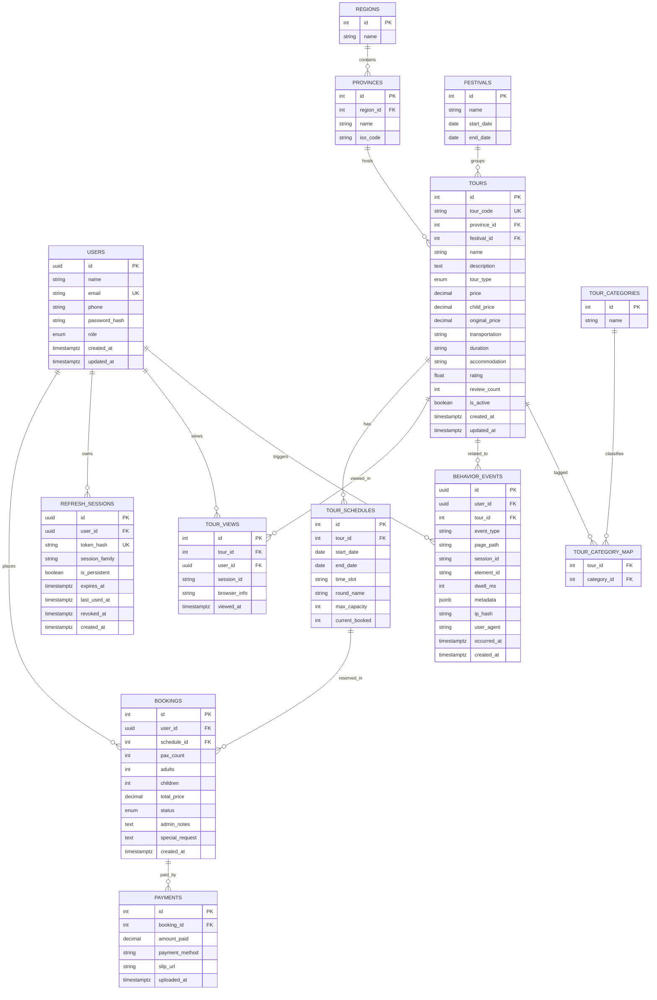
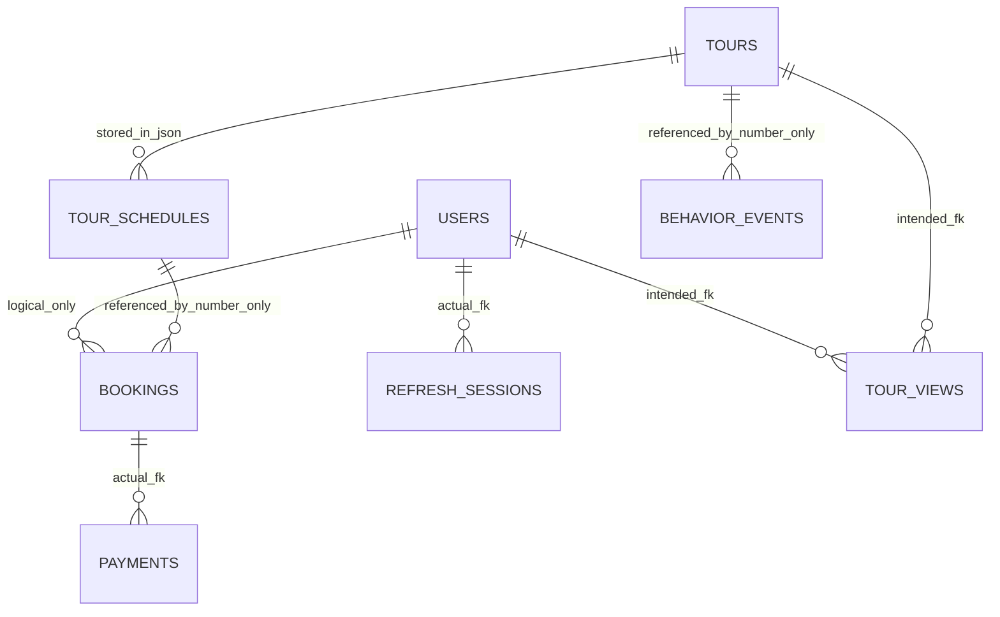

# ER Diagram Analysis for 9Tours

เอกสารนี้สรุป ER ของโปรเจ็กต์ 9Tours โดยอิงหลักพื้นฐาน ER จากวิชา Database Fundamentals:
- แยก `entity` ตามหน่วยข้อมูลหลักของธุรกิจ
- กำหนด `primary key` และ `foreign key` ให้ชัด
- ระบุ `cardinality` ของความสัมพันธ์
- ลดข้อมูลซ้ำและหลีกเลี่ยงการเก็บความสัมพันธ์ไว้เป็นค่าข้อความหรือเลขอ้างอิงลอย ๆ

หมายเหตุ: ใน environment นี้ไม่สามารถ parse ข้อความจากไฟล์ PDF ได้โดยตรง จึงยึดหลัก ER พื้นฐานที่ตรงกับหัวข้อของเอกสาร และเทียบกับโค้ด/ฐานข้อมูลที่ใช้อยู่จริงในโปรเจ็กต์

## 1. ER Diagram ที่ควรเป็นสำหรับโปรเจ็กต์นี้

## 2. สิ่งที่ระบบใช้อยู่ในปัจจุบัน

ภาพรวมปัจจุบันเป็นแบบ `hybrid`:
- ข้อมูล `users`, `bookings`, `payments`, `refresh_sessions`, `tour_views`, `behavior_events` ถูกออกแบบเป็นตาราง TypeORM
- แต่ข้อมูล `tours` และ `tour_schedules` ที่ endpoint หลักใช้จริง ยังอ่าน/เขียนจากไฟล์ `backend/tours-data.json`
- จึงเกิดสถานะที่ `logical schema` กับ `runtime data flow` ไม่ตรงกัน

ความสัมพันธ์ที่ใช้งานจริงตอนนี้ใกล้เคียงแบบนี้:

## 3. เปรียบเทียบ ER ที่ควรเป็น กับของที่ใช้อยู่ตอนนี้

| ประเด็น | ER ที่ควรเป็น | ของที่ใช้อยู่ตอนนี้ | ผลกระทบ |
|---|---|---|---|
| Tour กับ TourSchedule | ต้องเป็น `1:M` ใน DB เดียวกัน และ Booking ควร FK ไปที่ `tour_schedules.id` | `Booking.scheduleId` เป็นเลขธรรมดา และ service ไปหา schedule จาก `tours-data.json` | ไม่มี referential integrity จริง, ลบ/แก้ schedule แล้ว booking อาจค้าง |
| User กับ Booking | `bookings.user_id` ควรเป็น `uuid FK -> users.id` | `users.id` เป็น UUID แต่ `booking.userId` ถูกประกาศเป็น number | ชนิดข้อมูลไม่ตรงกัน, เสี่ยง query/constraint ผิด |
| User กับ TourView | `tour_views.user_id` ควรเป็น `uuid FK -> users.id` | `tourView.userId` ถูกประกาศเป็น number | ชนิด FK ไม่ตรงกับ PK ของ users |
| Region / Province | ควรเป็น master data และ `tour` ควร FK ไป `province_id` | `Tour.region` และ `Tour.province` เป็น string ตรง ๆ | ซ้ำข้อมูล, สะกดต่างกันแล้ว query/report เพี้ยนได้ |
| Category | ทัวร์หนึ่งรายการมีได้หลาย category จึงควรใช้ `M:N` ผ่าน table กลาง | มีทั้ง `categories: jsonb string[]` และ `category_id` แบบเดี่ยว | schema ซ้ำซ้อนและขัดกันเอง |
| Tour storage | ตาราง `tours` ควรเป็น source of truth | CRUD หลักใช้ JSON file ไม่ใช้ `Repository<Tour>` | analytics/seeder กับ API หลักอาจเห็นข้อมูลคนละชุด |
| Analytics event | ถ้าต้องการความถูกต้องสูง ควรมี FK แบบ nullable ไป `users` และ `tours` | `behavior_events` เก็บ `userId` และ `tourId` เป็น scalar | ยืดหยุ่น แต่ DB ไม่ช่วยคุมความถูกต้อง |
| Derived metrics | ตารางสรุปเช่น dashboard stats ควรเป็น derived data | มี `dashboard_stats_daily` แล้ว | ส่วนนี้ถือว่าโอเคถ้าใช้เป็น summary table |

## 4. จุดที่พบจากโค้ดปัจจุบัน

1. `User.id` ใช้ UUID แต่ `Booking.userId` และ `TourView.userId` ยังประกาศเป็น number
   อ้างอิง: `backend/src/users/entities/user.entity.ts`, `backend/src/bookings/entities/booking.entity.ts`, `backend/src/analytics/entities/tour-view.entity.ts`

2. `Booking.scheduleId` ยังไม่เป็น relation กับ `TourSchedule`
   ใน entity มีแค่เลขอ้างอิง และมี comment ว่าไปอ่านข้อมูลจริงจาก `tours-data.json`
   อ้างอิง: `backend/src/bookings/entities/booking.entity.ts`

3. `ToursService` ใช้ไฟล์ `tours-data.json` เป็นแหล่งข้อมูลหลักสำหรับ create/find/update/delete
   อ้างอิง: `backend/src/tours/tours.service.ts`

4. entity ของ `Region` และ `Province` ถูกสร้างไว้ แต่ `Tour` ยังเก็บ `region`/`province` เป็น string ไม่ได้ FK ถึง master table
   อ้างอิง: `backend/src/regions/entities/region.entity.ts`, `backend/src/regions/entities/province.entity.ts`, `backend/src/tours/entities/tour.entity.ts`

5. `Tour` มีทั้ง `categories` แบบ JSONB array และ `category` แบบ `ManyToOne`
   แปลว่า schema ปัจจุบันมีสองแนวคิดปนกัน: multi-value attribute กับ normalized relation
   อ้างอิง: `backend/src/tours/entities/tour.entity.ts`

6. ฝั่ง controller/service ของ booking ส่ง `req.user.id` ลง service โดยใช้จริงเหมือนเป็นค่าชนิดเดียวกับ `booking.userId`
   แต่ `req.user.id` มาจาก JWT ของ user UUID
   อ้างอิง: `backend/src/bookings/bookings.controller.ts`, `backend/src/bookings/bookings.service.ts`

## 5. ข้อสรุปสำหรับงานชิ้นนี้

ถ้าเขียน ER diagram ตามหลักฐานข้อมูลพื้นฐาน โปรเจ็กต์นี้ควรมีแกนหลักเป็น:
- `User`
- `Tour`
- `TourSchedule`
- `Booking`
- `Payment`
- `Region`
- `Province`
- `TourCategory`
- `Festival`

พร้อม FK ชัดเจนระหว่างกัน โดยเฉพาะ:
- `Booking -> User`
- `Booking -> TourSchedule`
- `TourSchedule -> Tour`
- `Tour -> Province`
- `Province -> Region`

แต่ของที่ใช้อยู่ในปัจจุบันยังไม่เป็น ER เชิง relational เต็มรูปแบบ เพราะ:
- ยังใช้ JSON file แทน table บางส่วน
- มี FK ที่เป็นเลขอ้างอิงลอย ๆ
- มีชนิดคีย์ไม่ตรงกัน
- มี attribute หลายค่าที่ควรแยก relation แต่ยังเก็บเป็น JSON/string

## 6. ถ้าจะปรับให้ตรง ER มากขึ้น

1. ให้ `tours` และ `tour_schedules` ใน PostgreSQL เป็น source of truth หลัก
2. เปลี่ยน `bookings.user_id` และ `tour_views.user_id` ให้เป็น UUID
3. เปลี่ยน `bookings.schedule_id` ให้เป็น FK จริงไป `tour_schedules.id`
4. เปลี่ยน `tours.province` จาก string เป็น `province_id`
5. ทำ table กลาง `tour_category_map`
6. แยกให้ชัดว่า field ไหนเป็น transactional data และ field ไหนเป็น summary/analytics
